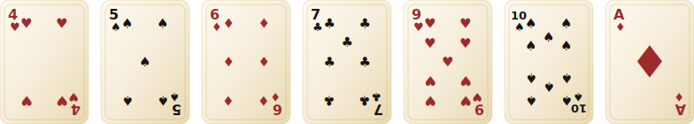
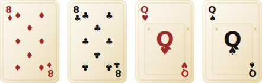
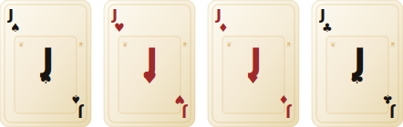
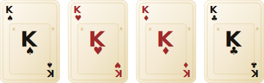
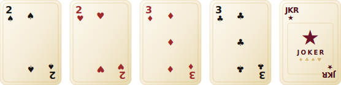

<div align="center">

```
  ╔═══════════════════════════════════════════════════════════╗
  ║                                                           ║
  ║       ♠  ♥  ♦  ♣    K  A  D  I    ♣  ♦  ♥  ♠            ║
  ║                                                           ║
  ║            T H E   O F F I C I A L   R U L E S           ║
  ║                                                           ║
  ╚═══════════════════════════════════════════════════════════╝
```

*also known as* **Kenyan Poker**

*A fast-paced card game for 2–5 players*

</div>

<br/>

## Overview

**Kadi** is a fast-paced Kenyan card game played with a standard 54-card deck. The objective is sharp and singular — be the first to play **all your winning cards in one move**. But you cannot play your last card silently. You must declare it first.

| Players | Deck | Goal |
|---------|------|------|
| 2 – 5 | 54 cards (standard + 2 Jokers) | Empty your hand — declare last card aloud |

<br/>

## The Five Card Categories

<br/>

### Category I · Answer Cards

> *The foundation of every hand. Played freely on matching suit or rank.*

<div align="center">
  
</div>

> **The Ace · A Quiet Power** — Playing an Ace lets you declare the suit the next player must follow. An Ace also cancels any pending penalty, returning play to the suit from before the chain began.

<br/>

### Category II · Question Cards

> *Queens and 8s ask a question. They must be answered — in the same turn — by an Answer Card of matching suit or rank.*

<div align="center">
  
</div>

> **A Question Demands an Answer** — Every Question Card must be paired with a matching Answer Card in the same play. Question without an answer? Draw, and your turn ends.

<br/>

### Category III · Jump Cards

> *The Jack skips the next player. Counter with your own Jack and the skip cascades down the line.*

<div align="center">
  
</div>

> **Compounding Jumps** — Stack multiple Jacks in a single turn to skip multiple players. Each Jack drops one more rival from the round.

<br/>

### Category IV · Kickback Cards

> *The King reverses direction of play. Chain them — each King flips the flow once more.*

<div align="center">
  
</div>

> **Counter or Compound** — The player about to be acted upon may play their own Kickback to reverse it. Multiple Kings in one turn flip the direction once for each.

<br/>

### Category V · Penalty Cards

> *The 2, 3, and the two Jokers. The harshest weapons in the deck — forcing the next player to draw.*

<div align="center">
  
</div>

> **Three Ways to Survive** — The targeted player may escape by playing another Penalty Card of the same rank (forwarding the draw), or by playing an Ace (cancelling it entirely). After a Joker, play continues with the suit and rank from the prior penalty.

<br/>

## How to Win

1. Play down to **one card** in your hand
2. **Announce it** — say *"Kadi"* aloud before your turn
3. Play that final card — it must be a valid play
4. If you forget to call *Kadi*, you **cannot** play your last card — draw one instead

> A player who wins must go out in a **single clean move**. No partial plays on the final turn.

<br/>

## Getting Started

```bash
npm install
npm run dev
```

The app runs at `http://localhost:5173` by default.

<br/>

<div align="center">

*Built with React · TypeScript · Tailwind CSS · Framer Motion*

<br/>

♠ &nbsp;&nbsp; ♥ &nbsp;&nbsp; ♦ &nbsp;&nbsp; ♣

</div>
